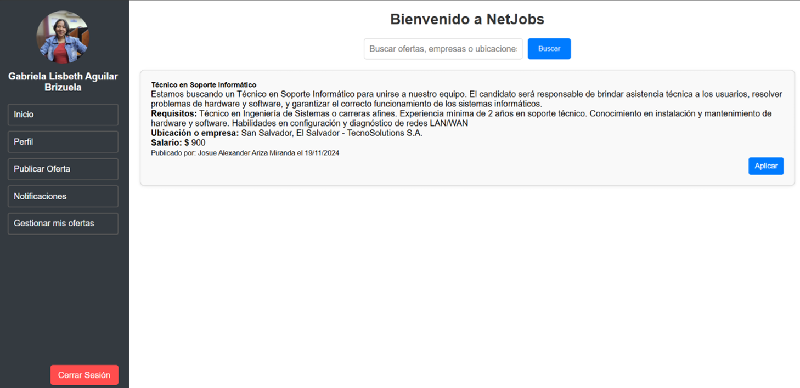
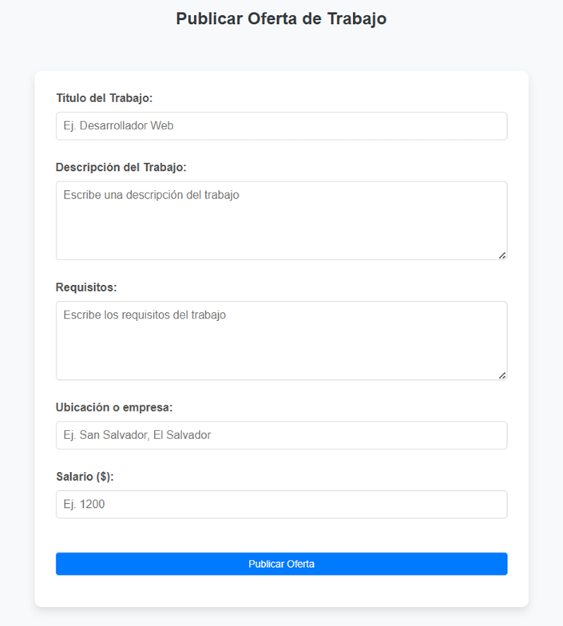
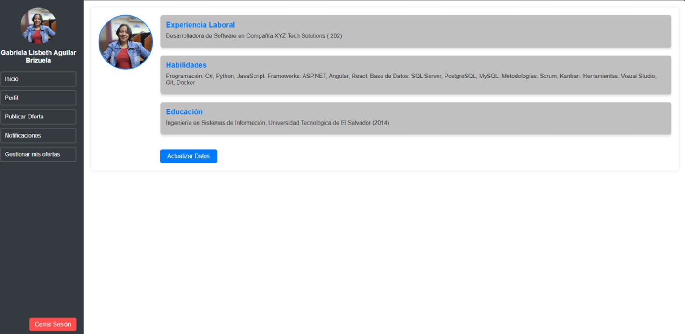
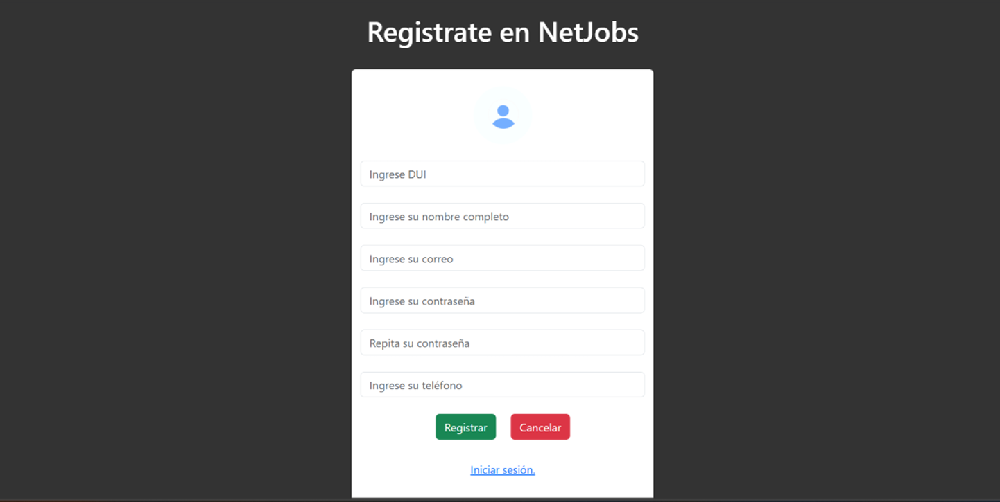
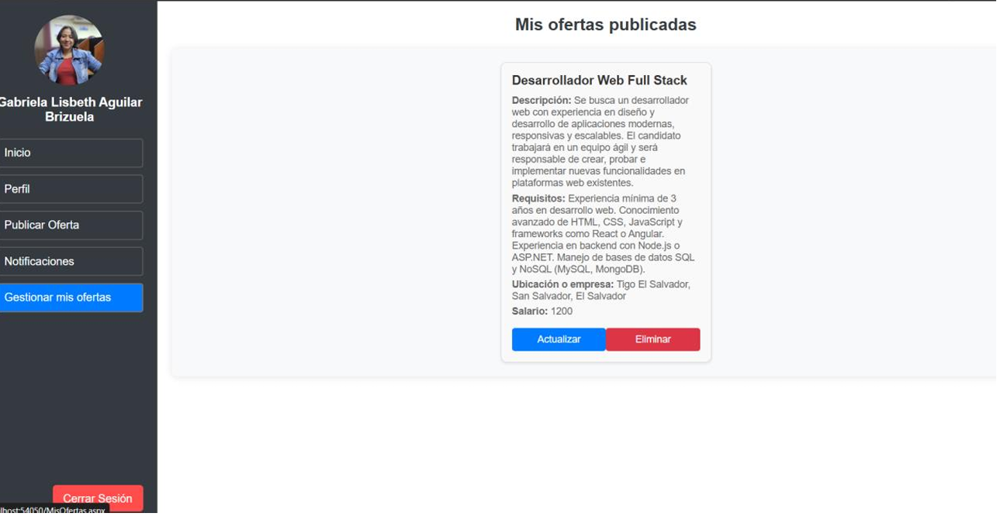
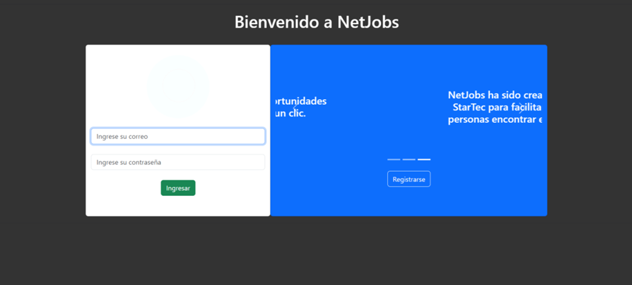

# NetJobs – Aplicación Web para Búsqueda de Empleo

## Descripción
**NetJobs** es una aplicación web desarrollada en **C# con ASP.NET Web Forms (ASPX)** y **SQL Server**, que funciona como una red social enfocada en la búsqueda de empleo.  
Permite a los usuarios **publicar ofertas laborales**, **aplicar enviando su CV** y a los empleadores **visualizar los candidatos que aplicaron** a sus publicaciones.  
Los perfiles incluyen datos personales, experiencia laboral, formación académica y foto de perfil, ofreciendo una experiencia completa de gestión de usuarios.

---

##  Tecnologías utilizadas
- **Lenguaje:** C#  
- **Framework:** ASP.NET Web Forms (ASPX)  
- **Base de datos:** SQL Server (procedimientos almacenados, consultas relacionales)  
- **Frontend:** HTML, CSS

---

## ⚙️ Funcionalidades principales
- Registro y autenticación de usuarios.  
- Publicación de ofertas de empleo.  
- Aplicación a ofertas mediante envío de CV.  
- Visualización de candidatos aplicados por parte del empleador.  
- Gestión de perfil: experiencia laboral, formación académica, habilidades y foto de perfil.  
- CRUD de usuarios y publicaciones con conexión a SQL Server.  

---

## 📸 Capturas de pantalla

### Dashboard principal

### Publicación de oferta de empleo

### Aplicación a oferta

### Visualización de candidatos

### Perfil de usuario

### Registrar usuario

### Gestionar ofertas

### Login

